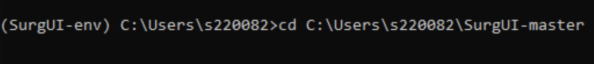

<h1 align="center">
Surgical Video Annotation Software
</h1> 

<h1 align="center">
  
</h1>

## Description

A graphical video annotation tool, originally developed for labeling surgical videos. It is an easy to use software for labeling videos by creating customizable panels for:

- time-stamping the beginning and end of segments such as activities/tasks
- rating the videos/segments based on a custom scoring system
- extracting and saving important frames such as critical views
- pixel-level annotation of the images by opening in [labelme](https://github.com/wkentaro/labelme/) software

## Installation for the DISE project (verified on Mac)

- Download the SurgUI-master zipped repository [here](https://github.com/wzkariampuzha/SurgUI/archive/refs/heads/master.zip) 
- Unzip it
- Download \& install Anaconda
  - [Anaconda](https://www.anaconda.com/download/success)
  - Open the Anaconda-Navigator app
  - Update Anaconda-Navigator if necessary
- Download \& install VLC media player
  - [Mac install (Universal Binary)](https://get.videolan.org/vlc/3.0.21/macosx/vlc-3.0.21-universal.dmg) 
  - [Windows install](https://apps.microsoft.com/detail/xpdm1zw6815mqm?ocid=webpdpshare)

 - Open the terminal app (Mac) or Windows powershell:
    - Now you need to navigate to the folder where you copied the SurgUI-master folder 
    - Eg. If you copied the SurgUI-master folder	 to `C:\Users\SurgUI-master` then in the command line write `cd C:\Users\SurgUI-master`. To copy the pathname of your SurgUI folder on macOS, see [here](https://support.apple.com/en-gb/guide/mac-help/mchlp1774/mac#:~:text=Show%20the%20path%20to%20a,show%20the%20path%20bar%20momentarily.).  
    - See this example: 
    - 
    - ```shell
        cd path/to/SurgUI-master
        ```
    Then run these commands:
     - ```shell
        conda env create --file environment.yml
        conda activate surgui-venv
        ```
    Install the software:
    - ```shell
        python setup.py install
      ```

## Usage
- Open VLC media player

- Open terminal and run the following command (update the path to where your own SurgUI-master folder is located):
    ```shell
    conda activate surgui-venv
    cd path/to/SurgUI-master
    python surgui
    ```

### Segment Rating:
For annotating the start and end of segments, first click File then "Add Rating Panel" then select the `RatingsPanel-Anatomy.txt` file. Then click File, "Add Timestamp Panel", select `TimeStampPanel-ObstructedViews.txt`. Then click File and find and open a video. For each video that is playing, a folder with the same name is created in “outputs” directory.

#### Rating System: 
Every time you see a new anatomical segment, mark the start time, play through *until you can identify that you are no longer in the same anatomical segment*, mark the end time, then click a rating:
- 1: No significant secretions 
- 2: Secretions that don't impeded visualization 
- 3: Secretions that impede visualization, but don't completely block your view 
- 4: Secretions that completely block your view, making it difficult to get a good assessment
- 5: Nothing, do not use this rating

Every other segment, take a screenshot and then use the labelme software to draw out secretions that obscure the lens.

#### Obstructed Views:
- Use this time stamp panel to mark any time points where the view is so obscured that you cannot ascertain which anatomical structure is being visualized.
- Use this even when you know that you are in an anatomical segment (because the camera has not moved), but you could not tell which segment you are in solely from the frame.

#### Saved Annotations
The saved images and the .json files from labelme annotations are stored in `images` folder for each video.
